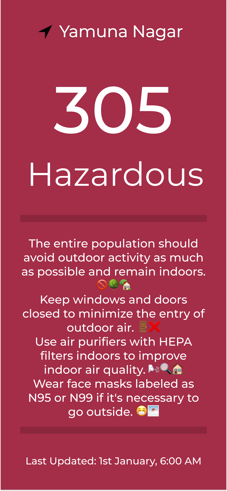
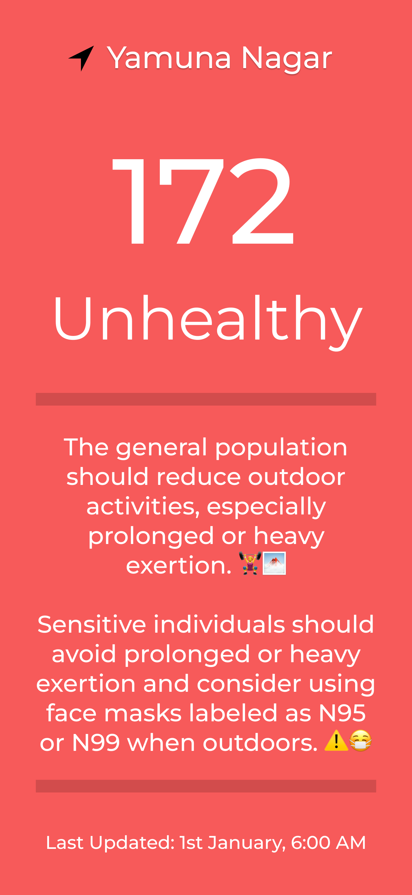
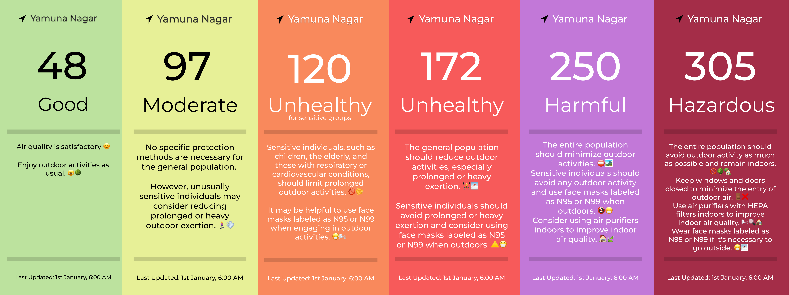

# EcoAir: AQI Tracker 🌍🌬️

EcoAir is an elegant and intuitive Android application designed and developed to track Air Quality Index (AQI) in remote areas. By utilizing the CPCB API, EcoAir provides real-time information on air quality, contributing to promoting healthier living and raising awareness about air pollution.

<br>

## Description 📝

EcoAir is a powerful tool that allows users to stay informed about the air quality in their surroundings. The application fetches real-time data from the CPCB API and presents it in a user-friendly interface. Users can easily view the current AQI, pollutant levels, and other relevant information for their location. Additionally, EcoAir provides personalized recommendations to help users make informed decisions and take necessary precautions based on the air quality conditions.

<br>

## Features ✨

- Real-time tracking of Air Quality Index (AQI)
- Detailed information on pollutant levels
- Personalized recommendations for healthier living
- User-friendly and intuitive interface
- Integration with the CPCB API for accurate data

<br>

## Screenshots 📷

<!-- Add your screenshots here -->




<br>

## Getting Started 🚀

Follow the steps below to get started with EcoAir:

### Prerequisites

- Flutter SDK installed on your development environment
- Android device with USB debugging enabled or an Android emulator

### Installation

1. Clone the EcoAir repository to your local machine:

```bash
   git clone https://github.com/your-username/EcoAir.git
```

2. Navigate to the project directory:

```bash
   cd EcoAir
```

3. Install the required dependencies:
```bash
   flutter pub get
  ```
5. Connect your Android device or start an emulator.
6. Run the app with the following command:
```bash
   flutter run
```

This command will build and deploy the EcoAir app to your connected device or emulator. Make sure that USB debugging is enabled on your device or that the emulator is properly set up.

6. Once the app is successfully installed and running, you can explore the features and track the Air Quality Index (AQI) in your desired location.

<br>

## Contributing 🤝

Contributions are always welcome! If you'd like to contribute to EcoAir, please follow these steps:

1. Fork the repository.
2. Create a new branch for your feature or bug fix:
   ```bash
   git checkout -b feature/your-feature-name
   ```
   
3. Make your changes and commit them:
  ```bash
   git commit -m "Add your commit message"
   ```

4. Push to the branch:
   ```bash
   git push origin feature/your-feature-name
   ```
   
5. Open a pull request and describe your changes in detail.

By contributing to EcoAir, you help make it a better tool for tracking air quality and promoting healthier living.

<br>

## Support and Feedback 📧

If you have any questions, feedback, or suggestions regarding EcoAir, please feel free to reach out:

- Developer: Guneet Singh
- Email: itsguneetsingh@gmail.com

Your support and feedback are valuable in improving EcoAir and making it a better tool for tracking air quality.

---

Thank you for your interest in EcoAir! Together, we can promote healthier living and raise awareness about air pollution.
